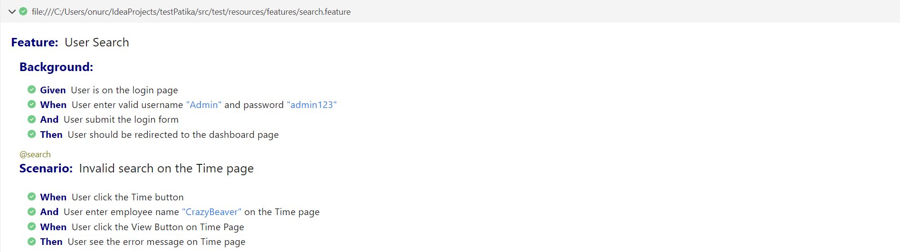
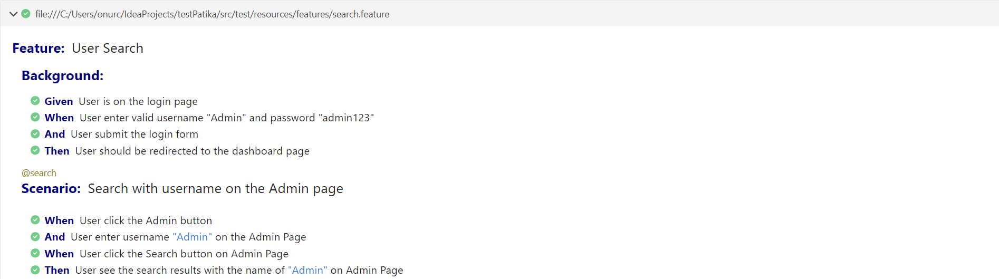
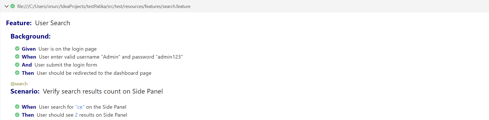
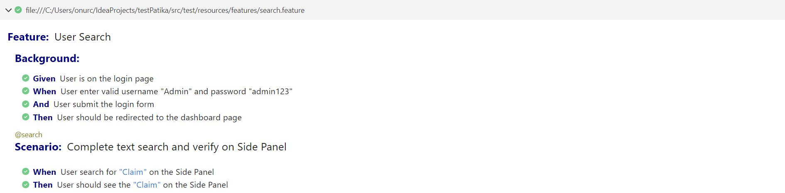
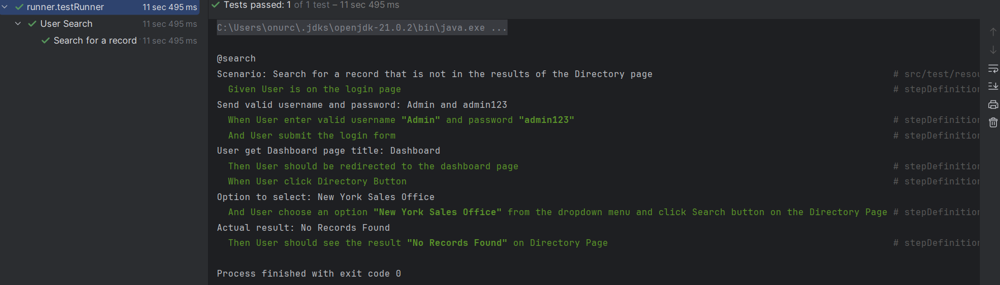
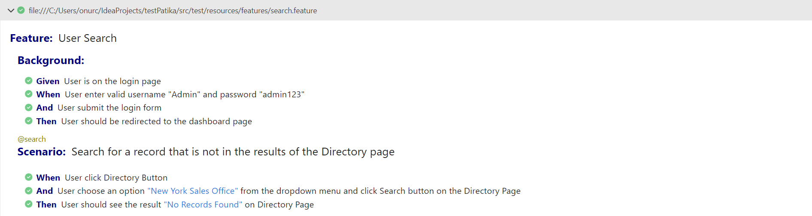
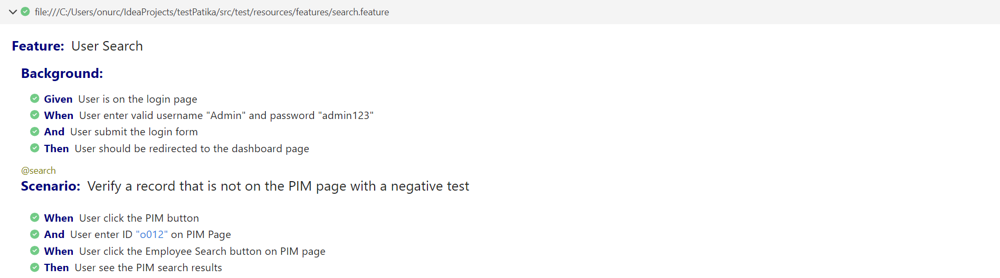

# Patika.dev & FMSS - Test Otomasyon Ödevi
InetlliJ IDEA, Selenium, Cucumber ve Junit kullanıldı.

## Valid-Invalid Login Senaryoları:
- Doğru kullanıcı adı ve şifre ile giriş
- Yanlış kullanıcı adı ve şifre ile giriş

## Search 1:
- Timesheet sayfasında invalid arama ve hata mesajını doğrulama

## Search 2:
- Admin sayfasında username ile arama ve sonucu doğrulama

## Search 3:
- Side panel arama sonuçlarındaki veri adedinin toplamını bulma 

## Search 4:
- Side panel direkt bir menü elemanını arama ve sonucu doğrulama

## Search 5:
- Directory sayfasında dropdown seçimi ile veri arama ve sonuçlarda eşleşen bir kayıt olmadığını doğrulama

## Search 6:
- Recruitment sayfasındaki tüm verileri listeleme ve toplam adedini bulup doğrulama

## Search 7:
- PIM sayfasında kayıtlarda olmayan bir kullanıcı ID'sini aratma ve var olmadığını negatif testle doğrulama 

